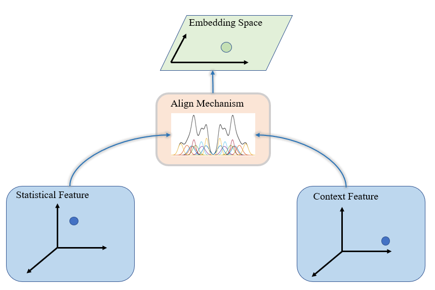
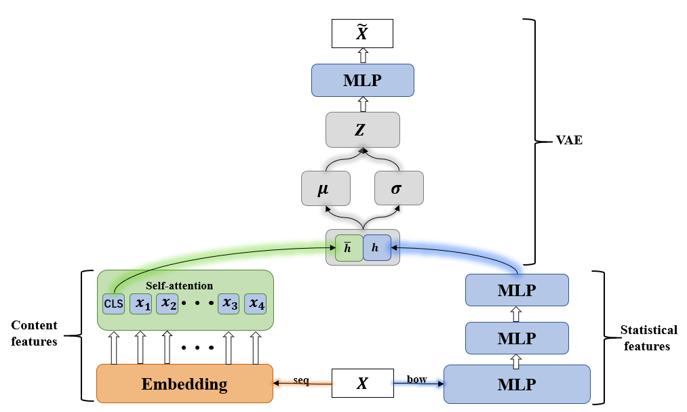
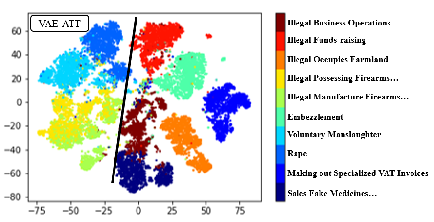

# Case2Vec:Joint VAE for Case Text Embedding Representation
Represent case text as a computable vector in the same space.

* train vae+selfatt model run: 
  python emb_train.py  
 
* train single vae model run: 
  python emb_single_train.py
  
* emb_config.py: 
  model structure | dataset | training | evauation | config file

In this paper ,we use the BOW get statistics information and TRANSFORMER get content information.Final ,we use VAE Align two types of information into the same space.

 
 
 
Model structure

 
 
 
we use vae encode case texts to vectors,and visualize. 

 
other results are in imgs/
 
 
 

